# Cartoon-Photo Classifier

Two comparative Tensorflow-Keras-based deeplearning convolutional neural networks (CNNs) to predict whether an image is a
cartoon or a photo. The simpler CNN makes use solely of the provided dataset, whereas the other CNN additionally benefits 
from the application of the weights from a pre-trained model in the process of transfer learning. The classifier based on 
transfer learning boosts the accuracy of the somewhat limited dataset to nearly 100%, and additionally manages to train more 
quickly in only a handful of epochs. This also means that the simpler model's code needs to be run a few times before a strong 
model emerges. With the transfer learning a strong model with around 99% accuracy is almost guaranteed at the first attempt. 
That said, the size of the transfer learning model is huge (63.295 times larger than that of the simpler model), and even in 
the case of the simpler classifier, the model managed to achieve a reasonable degree of accuracy on a relatively small dataset.

## Dataset

Cartoons come in varying genres and styles. They are characterised mostly by a non-realistic or semi-realistic style,
with vibrant or garish colours in a saturated colour palette and often with outline contours to the figures depicted.
The images used in this dataset tend to conform to this paradigm. Likewise, the photos were chosen to reflect animals,
faces and landscapes similar to those featured in the cartoons. The aim of the CNNs is to determine whether the neural
networks are able to find and learn the distinguishing features between the two types of images.

There are 250 JPEG images of either category, of varying sizes, and with an 8:2 split between training and validation
data. A set of 10 images were additionally set aside for testing purposes. All images were sourced by means of Google searches.

### Image Size Distributions

<br/>
<p align="center">
  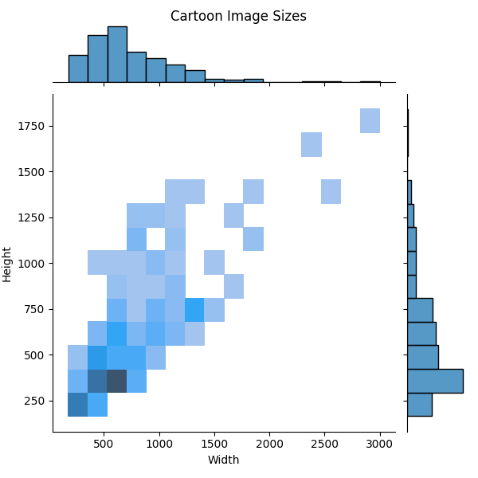
  
</p>

## 1. Simple Classifier

The current dataset of cartoons and images, with a combined total of 500 images, is quite small in comparison with the size 
of typically used CNN training datasets. This small dataset therefore cannot sufficiently cater for the many different subsets 
of styles and subjects featured in the cartoons and photos. This may lead to some degree of overfitting, hence the addition 
of dropout and regularisation to this CNN. The sourcing of more images should get around this issue and increase accuracy.

The simple classifier project is also mapped via TensorBoard. To follow the image and graph data there, do the
following:

* Once the code is running, run this command inside the terminal:
  ```tensorboard --logdir logs```.

* Open a browser window with the following URL:
  ```http://localhost:6006/```

#### TensorBoard Images

<br/>
<p align="center">
  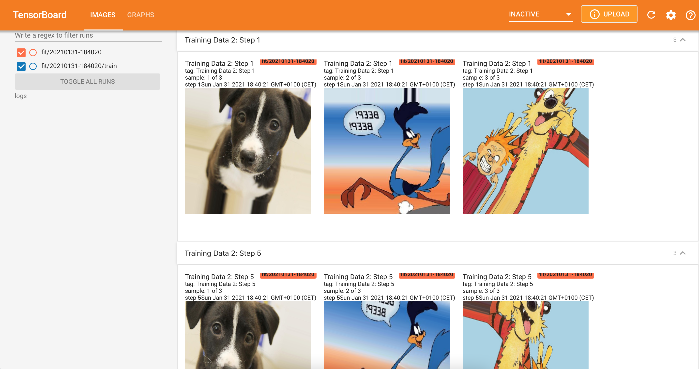
</p>

#### TensorBoard Graphs

<br/>
<p align="center">
  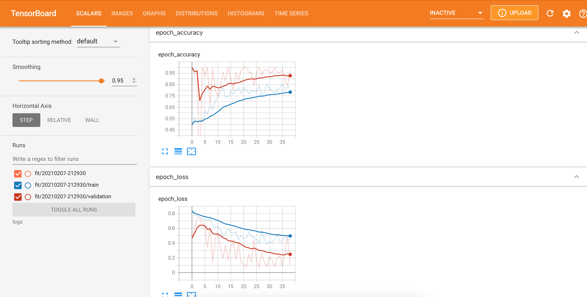
</p>

### Model Evaluation

#### Model Summary
* Model size in bytes: 20,059,760 (= 0.02005976 GB)
* Total params: 1,666,401
* Trainable params: 1,666,401
* Non-trainable params: 0

#### Accuracy and Losses During Training

<br/>
<p align="center">
  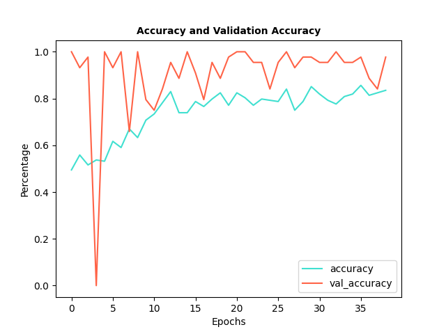
  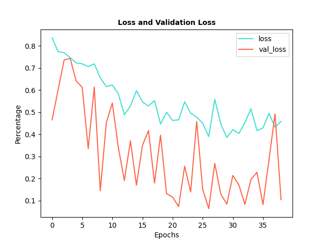
</p>

#### Classification Report

```
              precision    recall  f1-score   support

           0       0.81      0.96      0.88        48
           1       0.95      0.77      0.85        48

    accuracy                           0.86        96
   macro avg       0.88      0.86      0.86        96
weighted avg       0.88      0.86      0.86        96
```

#### Confusion Matrix

```
[[46  2]
 [11 37]]
 ```

#### Testing with Unseen Data

A set of 10 test images is presented to the trained model to verify the test error:

| Filename      | Image                                                       | Prediction   | Result  | Degree of Certainty |
| ------------- | -----------------------------------------------------------:| ------------:|--------:|--------------------:|
| image-01.jpg  |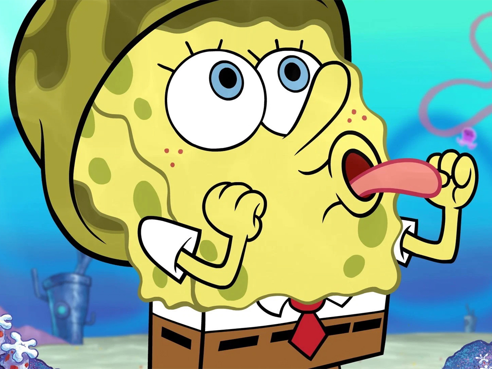| CARTOON      | ✅      |              100.0% |
| image-02.jpg  |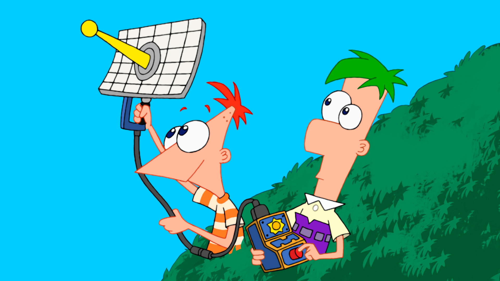| CARTOON      | ✅      |            99.9997% |
| image-03.jpg  |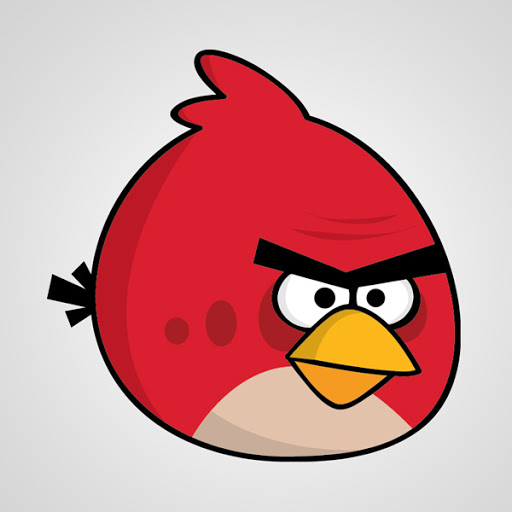| CARTOON      | ✅      |              100.0% |
| image-04.jpg  |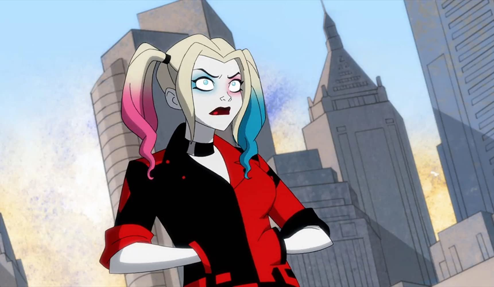| CARTOON      | ✅      |            98.6573% |
| image-05.jpg  |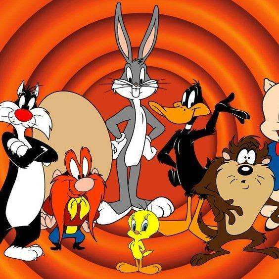| CARTOON      | ✅      |             99.994% |
| image-06.jpg  |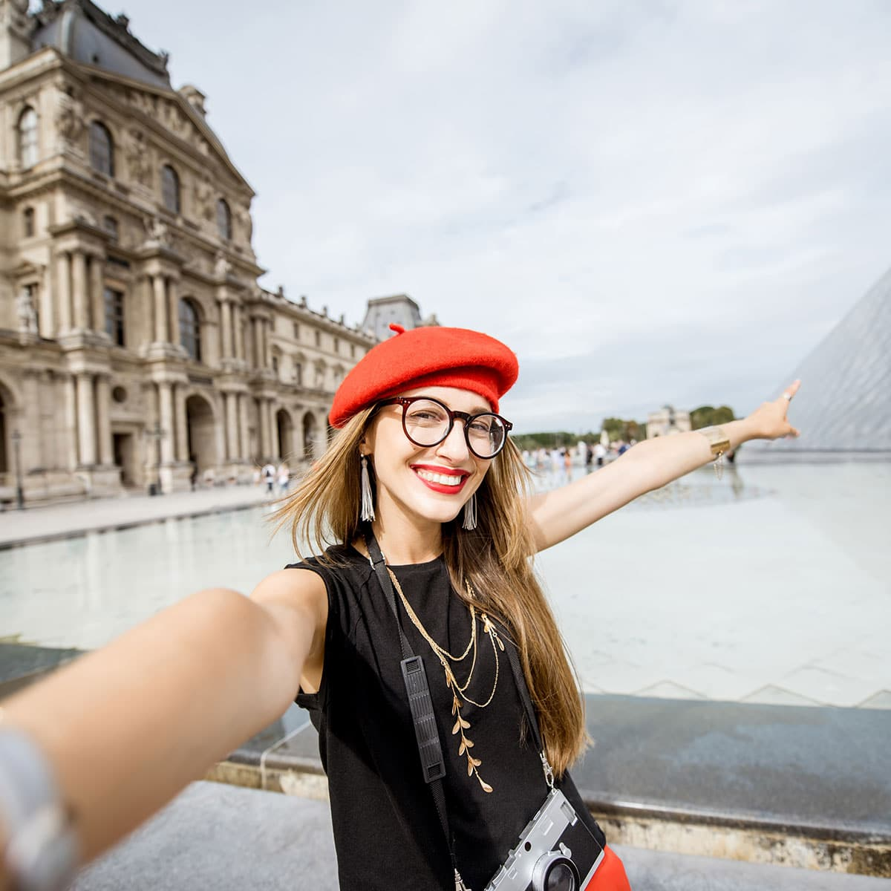| PHOTO        | ✅      |            59.3101% |
| image-07.jpg  |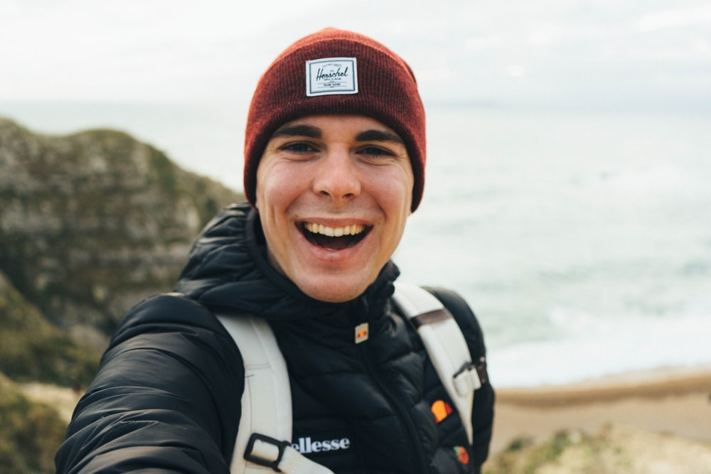| PHOTO        | ✅      |            84.3401% |
| image-08.jpg  |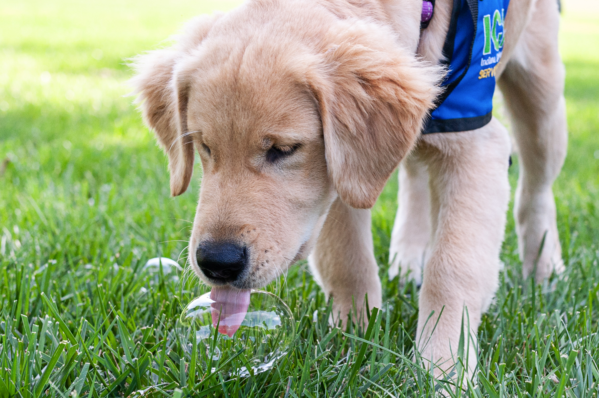| PHOTO        | ✅      |            80.1649% |
| image-09.jpg  |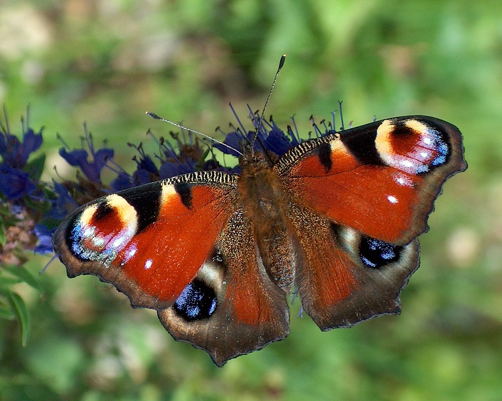| PHOTO        | ✅      |            80.8735% |
| image-10.jpg  |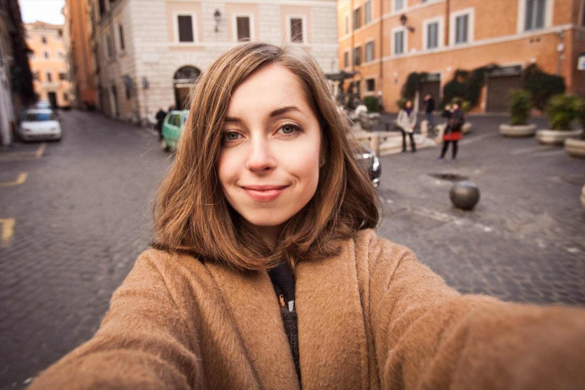| PHOTO        | ✅      |            90.1829% |

#### Test Error Simple Model

<div align="center">
  <p>
    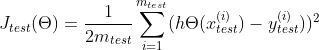
  </p>
</div>

Test error: 1.3792%

`image-06.jpg` and `image-09.jpg` are very colourful, as one would expect to see in a cartoon. In one case, the model
achieved an accuracy level of around 77% and incorrectly classified these images.

## 2. Transfer Classifier

In an attempt to get around any overfitting of the first attempt, and to increase the model's accuracy without having to
source additional dataset material, the second classifier is configured to make use of transfer learning. The transfer
learning is based on the [Inception V3](https://arxiv.org/abs/1512.00567) model.

### Model Evaluation

#### Accuracy and Losses During Training

<br/>
<p align="center">
  
  
</p>

#### Model Summary
* Model size in bytes: 1,269,686,560 (= 1.26968656 GB)
* Total params: 163,117,985
* Trainable params: 154,142,721
* Non-trainable params: 8,975,264

#### Classification Report

```
              precision    recall  f1-score   support

           0       1.00      1.00      1.00        48
           1       1.00      1.00      1.00        48

    accuracy                           1.00        96
   macro avg       1.00      1.00      1.00        96
weighted avg       1.00      1.00      1.00        96
```

#### Confusion Matrix

```
[[48  0]
 [ 0 48]]
 ```

#### Testing with Unseen Data

A set of 10 test images is presented to the trained model to verify the test error:

| Filename      | Image                                                       | Prediction   | Result  | Degree of Certainty |
| ------------- | -----------------------------------------------------------:| ------------:|--------:|--------------------:|
| image-01.jpg  || CARTOON      | ✅      |              100.0% |
| image-02.jpg  || CARTOON      | ✅      |              100.0% |
| image-03.jpg  || CARTOON      | ✅      |              100.0% |
| image-04.jpg  || CARTOON      | ✅      |            99.9501% |
| image-05.jpg  || CARTOON      | ✅      |              100.0% |
| image-06.jpg  || PHOTO        | ✅      |              100.0% |
| image-07.jpg  || PHOTO        | ✅      |              100.0% |
| image-08.jpg  || PHOTO        | ✅      |              100.0% |
| image-09.jpg  || PHOTO        | ✅      |              100.0% |
| image-10.jpg  || PHOTO        | ✅      |              100.0% |

#### Test Error Transfer Model

<p align="center">
  
</p>

Test error: 0.0004%.

NOTE: The `test_model.py` file allows for the running of the test data for both models.
