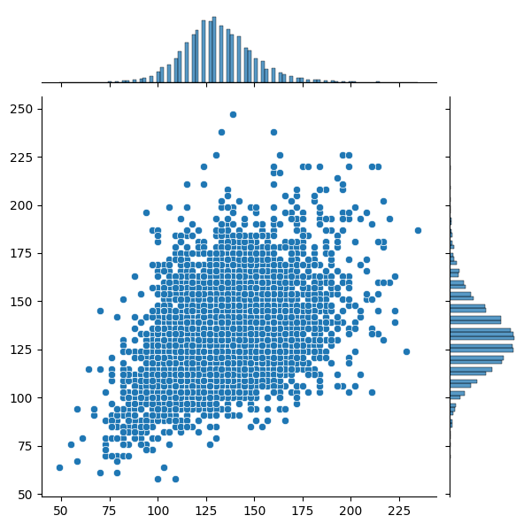

# Malaria Predictor

A Keras-based deeplearning CNN to predict whether a cell has been infected by malaria or not.

Based on the Udemy course: Complete TensorFlow 2 and Keras Deep Learning Bootcamp:
https://www.udemy.com/course/complete-tensorflow-2-and-keras-deep-learning-bootcamp

## Resources

* The project uses the malaria image dataset obtained from National Library of Medicine: https://lhncbc.nlm.nih.gov/publication/pub9932.

## Data Analysis

 

  

### Losses During Training
 

  
  

