# Image Filter Fashion MNIST

A Keras-based deep learning autoencoder that filters out noise from a given image. 
The Fashion MNIST dataset is read in, fed into an encoder, which, in turn, is linked with a decoder. 
A set of manually manipulated images with random noise added to them is then fed the autoencoder and a cleaner version of these images is then generated.

Based on the Udemy course: Complete TensorFlow 2 and Keras Deep Learning Bootcamp:
https://www.udemy.com/course/complete-tensorflow-2-and-keras-deep-learning-bootcamp

## Resources

* The project uses the Fashion MNIST dataset: https://github.com/zalandoresearch/fashion-mnist2.

### Images Generated
 

  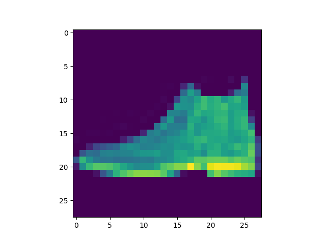
  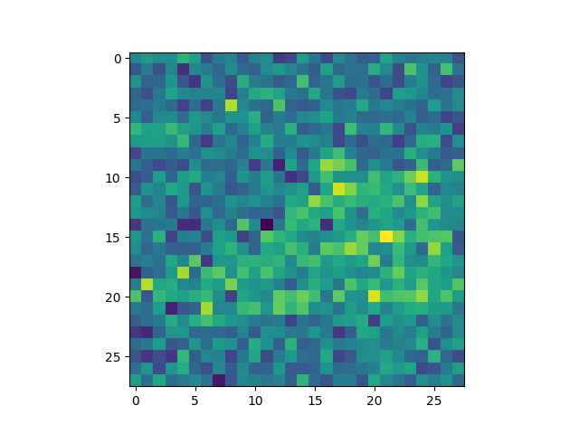
  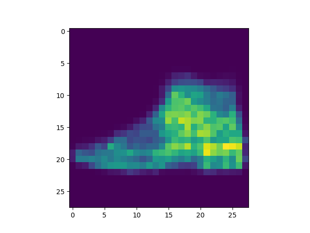

  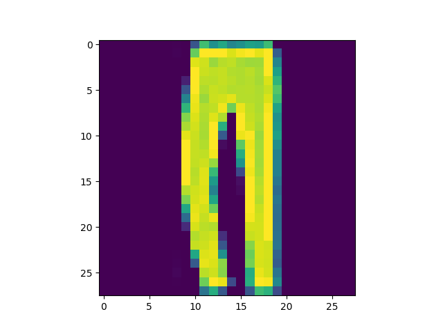
  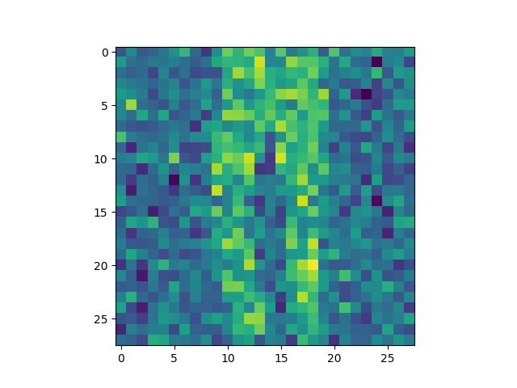
  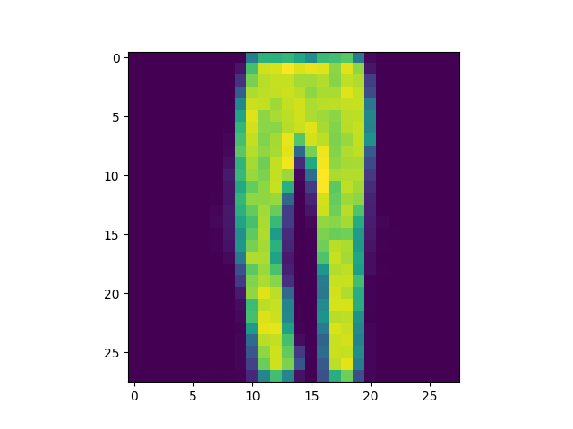

  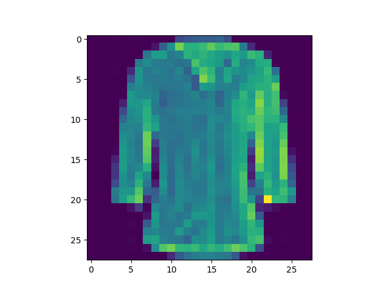
  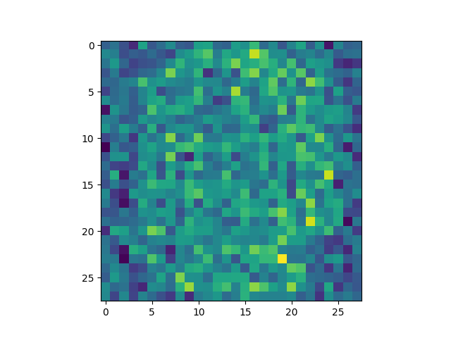
  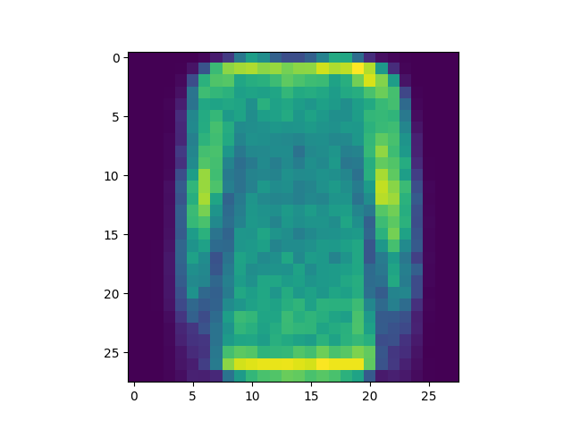

  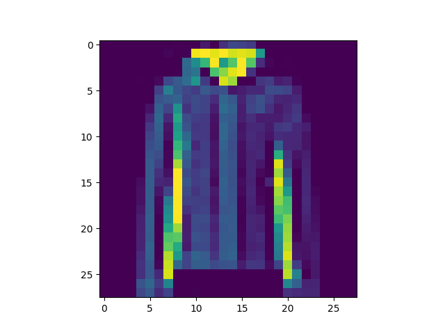
  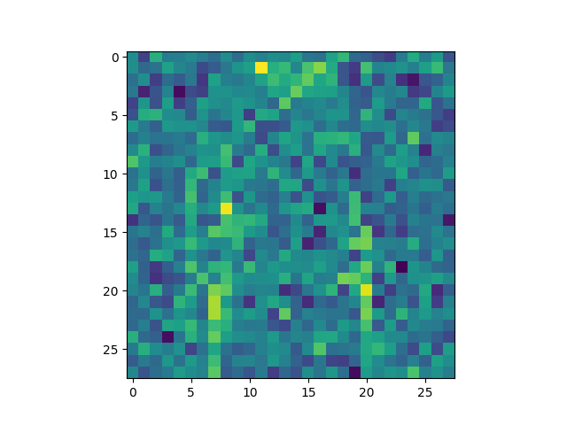
  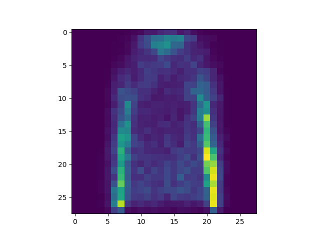

