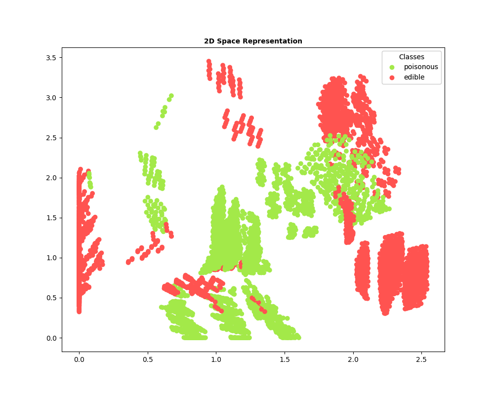

# Mushroom Dataset Autoencoder: Dimensionality Reduction

A Keras-based autoencoder employing the Mushroom Dataset in a dimensionality reduction exercise.

The Mushroom Dataset is a multivariate dataset. It consists of mushroom dimensions and appearances and classifies them
as being either edible or poisonous. The dataset consists of 23-dimensional data, which can only be visualised in 2 or 3
dimensions. The autoencoder is used to reduce the high-dimensional dataset to one that can be viewed in two dimensions.
Note that one of the dimensions is dropped due to insufficient data to some of the entries, and the class names are also
omitted. The dataset is also processed converted from a character to a numerical value.

The autoencoder consists of two layers, reducing the input data from 21 dimensions, down to 12 dimensions, down to 2
dimensions.

## Resources

### Data

* The project uses the Mushroom Dataset obtained from UCI Machine Learning Repository:
  https://archive.ics.uci.edu/ml/datasets/Mushroom

## Dimensionality reduction

The architecture of the autoencoder consists of an encoder with:
* 1 input layer with 21 nodes
* 1 hidden layer that reduced the 21 input dimensions down to 12 dimensions
* 1 output layer that further distills the dimensions down to 2.

  

## 2D Representation

The plots show that the two classes are not linearly separable when represented in a 2D space
(reducing the dimensions to a 3D rather than a 2D space added no meaningful benefit to the data visualisation).
The graphs at times also display some clumping together of data points within a class.
Nevertheless, a [deep neural network](https://github.com/Carla-de-Beer/tensorflow-2.x-projects/tree/master/dff/classifier/mushroom-dataset-classifier) is easily capable to differentiate between the two classes with a high level of accuracy.

  
  
  
  

