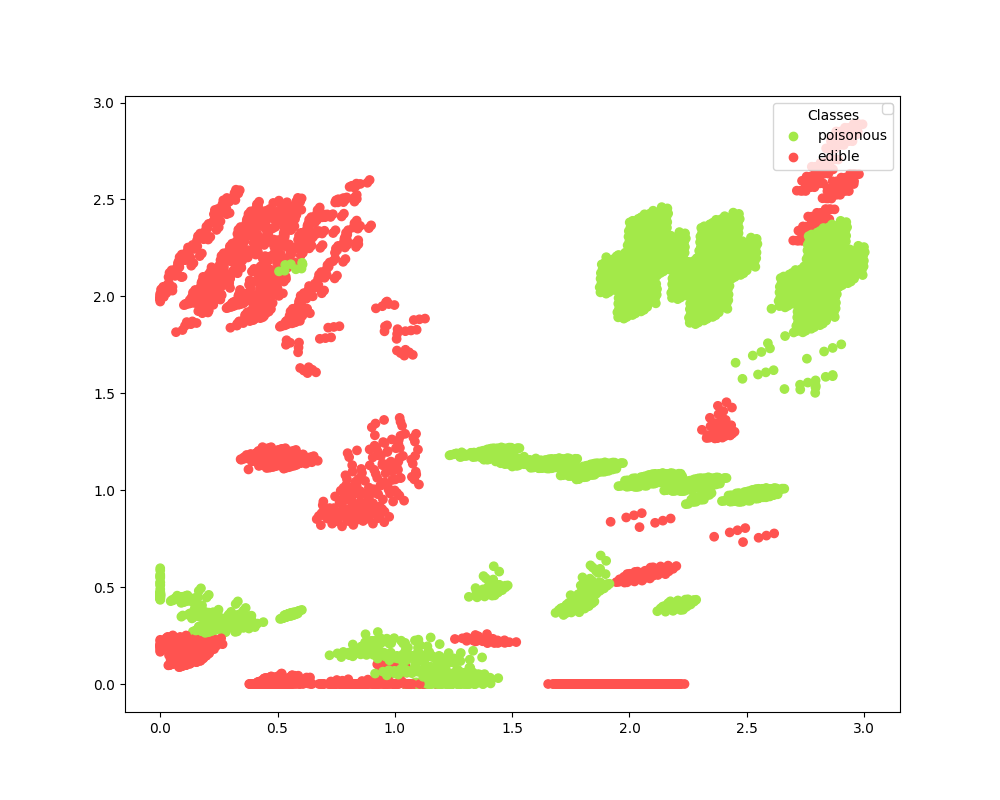

# Mushroom Dataset Autoencoder

A Keras-based autoencoder based on the Mushroom Dataset employed in dimensionality reduction.

The Mushroom Dataset is a multivariate dataset. It consists of mushroom dimensions and appearances and classifies them
as being either edible or poisonous. The dataset consists of 23-dimensional data, which can only be visualised in 2 or 3 dimensions.
The autoencoder is used to reduce the high-dimensional dataset to one that can be viewed in two dimensions. 
Note that one of the dimensions is dropped due to insufficient data to some of the entries, and the class names are also omitted.
The dataset is also processed converted from a character to a numerical value.

The autoencoder consists of two layers, reducing the input data from 21 dimensions, down to 12 dimensions, down to 2 dimensions.

## Resources

### Data

* The project uses the Mushroom Dataset obtained from UCI Machine Learning Repository:
  https://archive.ics.uci.edu/ml/datasets/Mushroom

## Dimensionality reduction
1 = Poisonous
 
2 = Edible

The plot shows that the groupings are not linearly separable when represented in a 2D space. Nevertheless, a 
[deep neural network](https://github.com/Carla-de-Beer/tensorflow-2.x-projects/tree/master/dff/classifier/mushroom-dataset-classifier) is 
capable to differentiate between the two classes wit a high level of accuracy.

  

