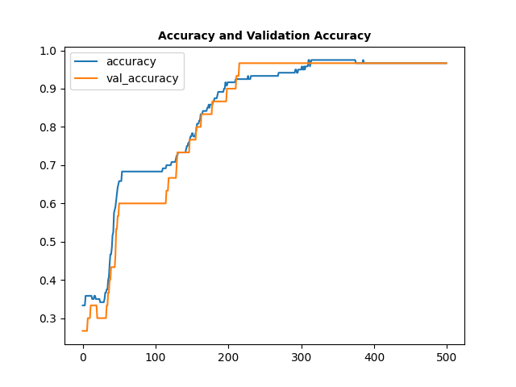

# Iris Dataset Classifier

A Keras-based deep feed-forward neural network classifying iris flower species given the input parameters provided. The iris species are as follows:

* *Iris Setosa*
* *Iris Versicolour*
* *Iris Virginica*

Based on the Udemy course: Complete TensorFlow 2 and Keras Deep Learning Bootcamp:
https://www.udemy.com/course/complete-tensorflow-2-and-keras-deep-learning-bootcamp

## Resources

* The project uses the famous iris flower dataset obtained from the UCI Machine Learning Repository:
https://archive.ics.uci.edu/ml/datasets/Iris

## Model Evaluation
### Losses During Training
 

  
  

