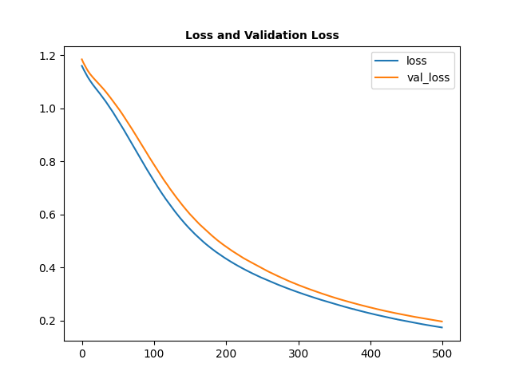

# Iris Flower Dataset Classifier

A Keras-based deep feed-forward neural network based on the Iris Flower Dataset.

The Iris Flower Dataset is a multivariate dataset developed by the British statistician and biologist Ronald Fisher as part of his academic paper `The use of multiple measurements in taxonomic problems` as an example of linear discriminant analysis. It consists of flower dimensions for three types of irises:

* *Iris Setosa*
* *Iris Versicolor*
* *Iris Virginica*

<figure>
  
  <figcaption>Image: http://www.lac.inpe.br/~rafael.santos/Docs/CAP394/WholeStory-Iris.html
  </figcaption>
</figure>
 

This project creates a machine learning classification model takes in a set of flower measurements and predicts which iris type this specimen is expected to belong to.

## Resources

* The project uses the iris flower dataset obtained from the UCI Machine Learning Repository:
https://archive.ics.uci.edu/ml/datasets/Iris

## Model Evaluation
### Losses During Training
 

  
  

