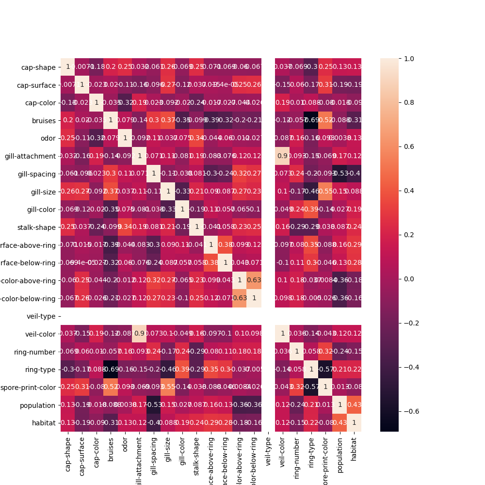
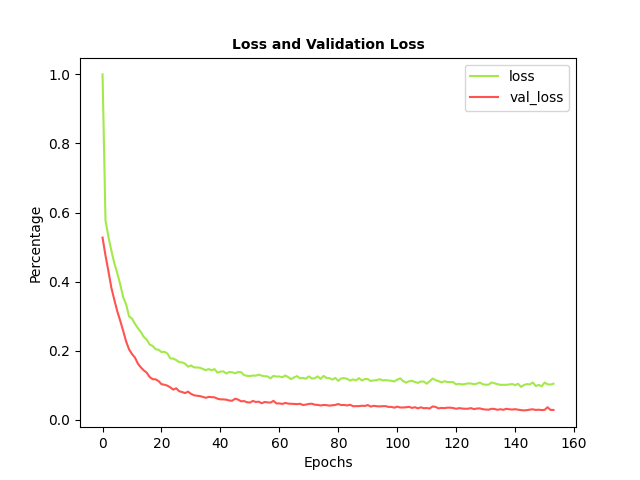
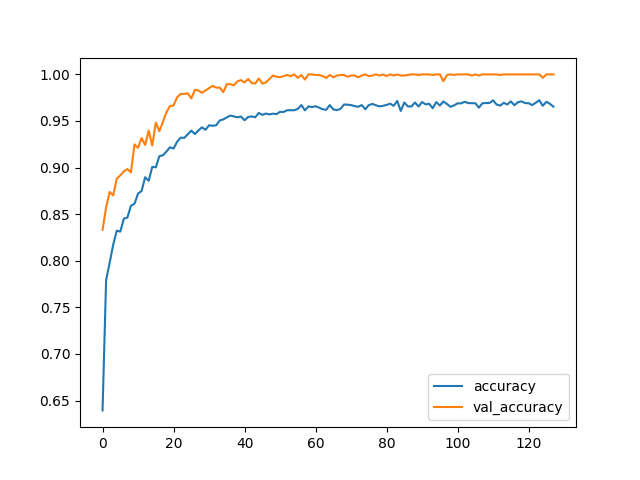

# Mushroom Dataset Classifier

A Keras-based deep feed-forward neural network based on the Mushroom Dataset.

The Mushroom Dataset is a multivariate dataset. It consists of mushroom dimensions and appearnaces 
and classifies them as being either edible or poisonous.

## Resources

* The project uses the Mushroom Dataset obtained from UCI Machine Learning Repository:
https://archive.ics.uci.edu/ml/datasets/Mushroom
  
 

  

## Model Evaluation
### Losses During Training
 

  
  

