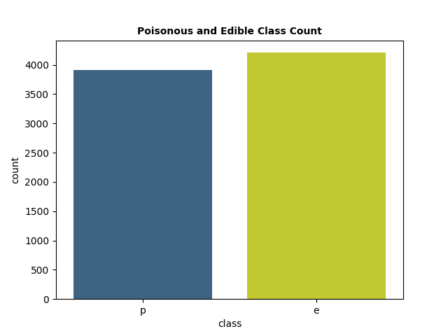

# Mushroom Dataset Classifier

A Keras-based deep feed-forward neural network based on the Mushroom Dataset.

The Mushroom Dataset is a multivariate dataset. It consists of mushroom dimensions and appearances and classifies them
as being either edible or poisonous.

## Resources

### Data

* The project uses the Mushroom Dataset obtained from UCI Machine Learning Repository:
  https://archive.ics.uci.edu/ml/datasets/Mushroom

<p align="center">
  
</p>

<p align="center">
  
</p>

## Model Evaluation

### Losses During Training

<p align="center">
  
  
</p>


### Classification Report

```
              precision    recall  f1-score   support

           0       1.00      1.00      1.00       851
           1       1.00      1.00      1.00       774

    accuracy                           1.00      1625
   macro avg       1.00      1.00      1.00      1625
weighted avg       1.00      1.00      1.00      1625
```

### Confusion Matrix

Condition Positive  | Condition Negative
------------- | -------------
847           | 9
0             | 768
