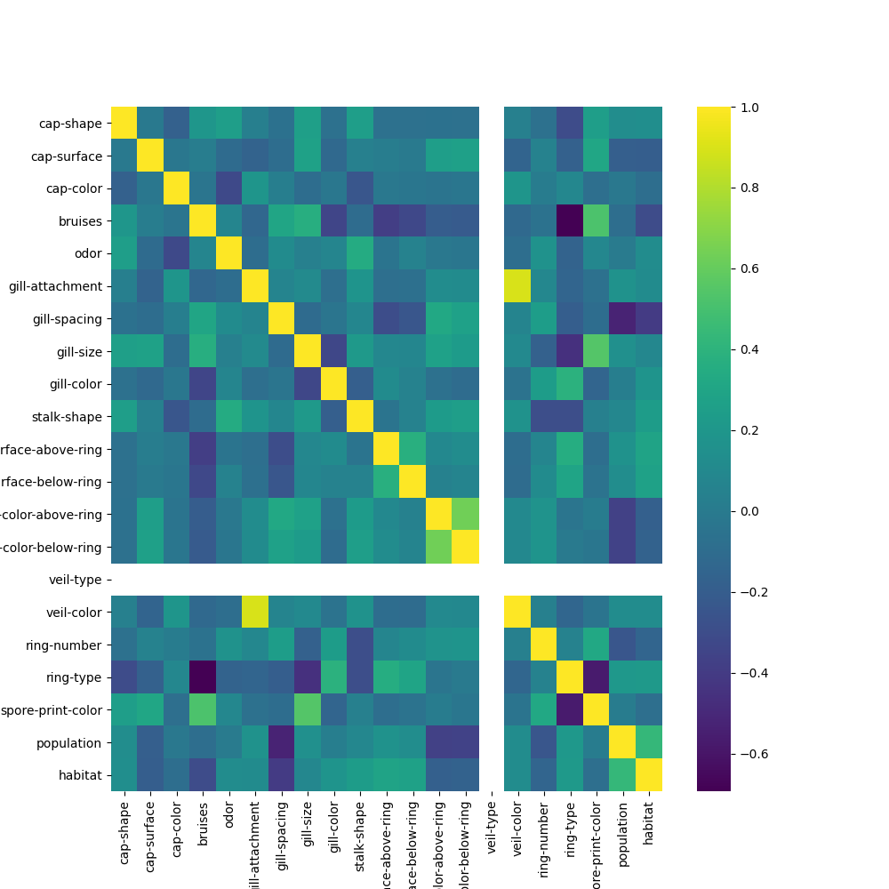
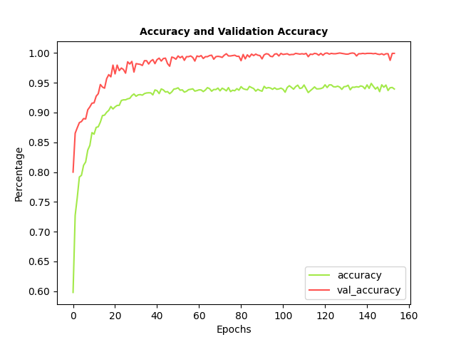

# Mushroom Dataset Classifier

A Keras-based deep feed-forward neural network based on the Mushroom Dataset.

The Mushroom Dataset is a multivariate dataset. It consists of mushroom dimensions and appearnaces and classifies them
as being either edible or poisonous.

## Resources

### Data

* The project uses the Mushroom Dataset obtained from UCI Machine Learning Repository:
  https://archive.ics.uci.edu/ml/datasets/Mushroom

  

  

## Model Evaluation

### Losses During Training

  
  

### Classification Report

precision     | recall        | f1-score      | support       | -
------------- | ------------- | ------------- | ------------- | -------------
0             | 1.00          | 0.99          | 0.99          | 856
1             | 0.99          | 768           | 768           | 768
accuracy      |               |               | 0.99          | 1624
macro avg     |  0.99         |   0.99        | 0.99          | 1624
weighted avg  |  0.99         |   0.99        | 0.99          | 1624

### Confusion Matrix

Condition Positive  | Condition Negative
------------- | -------------
847           | 9
0             | 768
