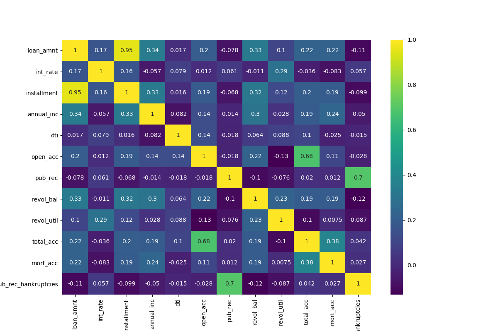
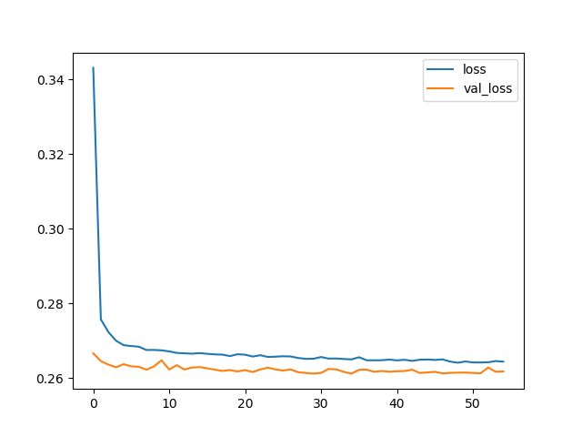

# Loan Predictor

A Keras-based deep feed-forward ANN to predict whether a customer is likely to repay a loan, or to default on it.

Based on the Udemy course: Complete TensorFlow 2 and Keras Deep Learning Bootcamp:
https://www.udemy.com/course/complete-tensorflow-2-and-keras-deep-learning-bootcamp

## Resources

* The project uses a subset of the LendingClub DataSet obtained from Kaggle: https://www.kaggle.com/wordsforthewise/lending-club.
Note that the images are contained within a zipped folder that needs to be unzipped prior to running the script file.

## Data Analysis

 

  
  
  
  
  
  

### Losses During Training

  

